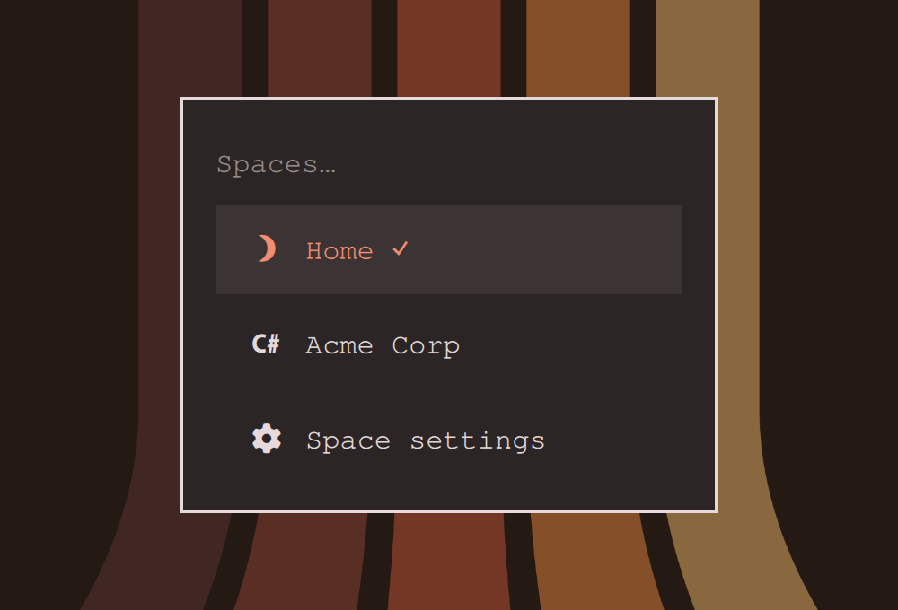
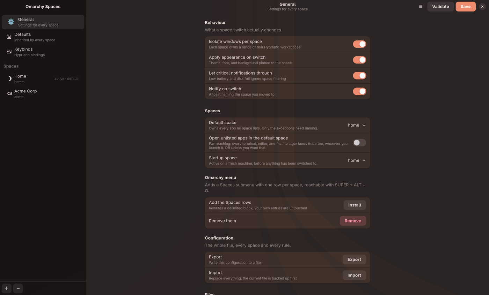

# Omarchy Spaces


Context spaces for [Omarchy](https://omarchy.org). A space is a named context
like Personal or HiScale. Each one owns a browser profile, an email address,
assistant accounts, and a notification policy. Switching spaces re-points all
of them at once.

Omarchy already has workspaces, which are about window layout. Spaces are about
identity. You can be on workspace 3 in either context, and the difference that
matters is whether a Slack message should interrupt you.

## Screenshots


The bar shows the active space. Click it for the picker, which switches spaces
and opens the settings app.





More in [docs/screenshots](docs/screenshots), and every page is walked through
in the [documentation](#documentation).

## What it does

Switch with a hotkey, the bar widget, or the CLI. The active space decides:

Which notifications reach you. In the work space you do not see personal
notifications. In the personal space you can choose to see both. Rules are per
space and can vary by time of day.

Where links open. Click a link in any app and it opens in that space's browser
profile. Personal links land in your personal Brave profile, work links in the
work one, with no profile picker in between.

Which accounts apply. Each space carries an email address and a set of
assistant accounts, readable by scripts through `omarchy-spaces get`.

Which windows you see. Each space owns a range of real Hyprland workspaces, so
SUPER+1 reaches different windows depending on the space. Windows never move on
a switch, which keeps it instant.

What the desktop looks like. A space can pin a theme, font, and background,
applied on switch.

## Notification policy

Each space declares which spaces' notifications it will show, and a schedule
that overrides that baseline by time of day.

```json
{
  "id": "personal",
  "notifications": {
    "allowFrom": ["personal", "work"],
    "schedule": [
      { "from": "08:00", "to": "17:00", "allowFrom": ["personal", "work"] },
      { "from": "17:00", "to": "22:00", "allowFrom": ["personal"] },
      { "from": "22:00", "to": "08:00", "allowFrom": [], "allowUnassigned": false }
    ]
  }
}
```

That reads as: during working hours show everything, in the evening show
personal only, and go silent overnight. Windows may wrap past midnight. The end
bound is exclusive, so `08:00 to 17:00` and `17:00 to 22:00` never both match.

A notification belongs to a space when that space lists its app in `apps`.
Anything unmatched is unassigned, and `allowUnassigned` decides whether those
still get through. Critical notifications bypass filtering unless you set
`criticalBypass` to false, because losing a low battery warning to a context
filter is a bad trade.

Run `omarchy-spaces validate` to find gaps, overlaps, and references to spaces
that do not exist.

## How filtering works

The plugin does not replace Omarchy's notification daemon. It lets
`omarchy.notifications` accept everything, then removes the popups the current
policy blocks. Three things follow from that choice.

History stays complete. A notification blocked in the work space is still in
history when you switch back to personal, so nothing is lost, only deferred.

The stock DND toggle keeps working. When a policy blocks everything, the
service mirrors that into the built-in `doNotDisturb` flag, so the normal DND
icon tells the truth. It only clears the flag again if it was the one that set
it, so a manual DND is never undone by a schedule boundary.

Omarchy owns the D-Bus name. Replacing the daemon would mean reimplementing
history, images, actions, and the popup lifecycle, and it would break whenever
Omarchy changed any of them.

## Install

```bash
git clone https://github.com/Samy104/omarchy-spaces.git
cd omarchy-spaces
./install.sh --with-url-handler
omarchy plugin enable io.github.samy104.omarchy-spaces
omarchy restart shell
```

`install.sh` copies the plugin into `~/.config/omarchy/plugins/`, puts the CLI
on your PATH, and writes a starter config. Everything lives under `$HOME` and
needs no sudo. Drop `--with-url-handler` if you do not want link routing yet.

Add the space rows to the Omarchy menu:

```bash
omarchy-spaces install-menu
```

That splices a delimited block into
`~/.config/omarchy/extensions/omarchy-menu.jsonc`, leaving your own entries and
comments untouched. Re-run it after adding a space. `omarchy-spaces remove-menu`
takes it back out.

Add keybindings from `hypr/spaces.lua` to `~/.config/hypr/bindings.lua`. Check
for conflicts first with `omarchy menu keybindings --print`.

| Keys | Action |
|---|---|
| SUPER + ALT + O | Open the picker |
| SUPER + ALT + N | Next space |
| SUPER + ALT + I | Show the current policy |
| SUPER + ALT + P | Switch to personal |
| SUPER + ALT + W | Switch to work |

## Command line

```
omarchy-spaces list                 every space, active one marked
omarchy-spaces current [--json]     the active space id
omarchy-spaces switch <id>          make a space active
omarchy-spaces next | prev          cycle
omarchy-spaces status [--json]      the policy in effect right now
omarchy-spaces open <url>           open a url in the active space's browser
omarchy-spaces which [url]          print the argv `open` would run
omarchy-spaces get <field>          read a field off the active space
omarchy-spaces init [--force]       write a starter config
omarchy-spaces validate             check for gaps, overlaps, bad references
omarchy-spaces install-menu         add the space rows to the Omarchy menu
omarchy-spaces remove-menu          take them back out
omarchy-spaces menu                 print the rows without writing anything
```

`get` reads any top level field, plus `assistant.<tool>`:

```bash
omarchy-spaces get email            # samy@hiscalesolutions.com
omarchy-spaces get assistant.codex  # work
```

## Hooks

Any executable in `~/.config/omarchy-spaces/hooks/` runs on every switch, in
filename order, with `OMARCHY_SPACE` and `OMARCHY_SPACE_PREVIOUS` in the
environment. Use them to swap SSH configs, git identities, or VPN profiles
alongside the space.

## Configuration

Config lives at `~/.config/omarchy-spaces/spaces.json`. The active space is
stored separately in `~/.local/state/omarchy-spaces/active`, so config is
something you edit and state is something the system writes.

| Field | Meaning |
|---|---|
| `id` | Stable identifier used by the CLI and by `allowFrom` |
| `name` | Display name in the bar and panel |
| `icon` | Glyph for the bar, a Nerd Font codepoint works |
| `color` | Accent color for the icon |
| `browser.command` | Executable, for example `brave` |
| `browser.profile` | Passed as `--profile-directory` |
| `browser.args` | Extra flags before the profile flag |
| `email` | Address associated with the space |
| `assistants` | Map of tool name to account name |
| `apps` | App names owned by this space, matched case insensitively |
| `notifications.allowFrom` | Baseline list of spaces to show |
| `notifications.allowUnassigned` | Whether unmatched apps get through |
| `notifications.schedule` | Time windows that override the baseline |

## Testing

```bash
./test/run.sh             # everything
```

Four suites. 25 unit tests over the policy rules, 2880 parity comparisons, a
check that the embedded starter config matches the repo copy, and a CLI smoke
test that runs the binary from a directory with no repo above it.

The policy rules exist twice, once in `SpacesLogic.js` for the shell plugin and
once in `bin/omarchy-spaces` for the CLI. The CLI is python because Hyprland
keybindings and desktop handlers run with a minimal PATH where a mise managed
node may not resolve, while python3 is always present.

Two implementations can drift, so `test/parity.sh` runs both across every
minute of the day, for every space and a set of sample apps, and fails if a
single decision differs. That is 2880 comparisons per run.

## Status

Version 0.9.1, running on Omarchy 4.0.0 with no QML warnings.

Verified on a live shell: the bar widget renders and follows a switch made from
anywhere, a personal-app notification is suppressed while the work space is
active, a work-app notification still gets through, and both land in history
either way. The policy engine, CLI, browser routing, hooks, menu picker, and
config validation are covered by the test suite.

Also verified live: switching jumps to the space's workspace range, a window
moved with `move-to-space` lands in the target range while the rest stay put,
and a pinned theme is applied on switch.

`omarchy-spaces-config` is a GTK4 and libadwaita editor for all of it. Click
the Spaces indicator in the bar and pick "Space settings" to open it. It has
General, Defaults, and Keybinds pages beside the per-space ones. Keybinds are
recorded by pressing the combination, checked for conflicts, and written to a
delimited block in `bindings.lua`.

A `defaults` block supplies values every space inherits, so a shared browser,
schedule, or workspace count is written once. See
[Defaults and inheritance](docs/Defaults-and-inheritance.md).

The bar ships its own workspace widget so the numbers shown match the numbers
you press. It is a second plugin directory only because Omarchy's third-party
scanner reads one manifest per folder. It installs, enables, and uninstalls
with the main plugin as one package. Omarchy's stock widget prints real ids, which read 11 to 20 in the
work space.

Audited against the Omarchy plugin
[develop](https://omarchyplugins.com/develop.html) and
[publish](https://omarchyplugins.com/publish.html) guidelines. See
[Publishing](docs/Publishing.md).

## Requirements

Omarchy 4.0.0 or newer, and python3, which Omarchy already ships.

The configuration app additionally needs `python-gobject`, `gtk4`, and
`libadwaita`. `install.sh` skips it when they are absent, and everything else
keeps working.

Nothing here needs root. There is no sudo, no system directory is touched, and
every file is written under `$HOME`. The plugin runs inside the Omarchy shell
process with your user's permissions, unsandboxed, like every Omarchy plugin.

The CLI shells out to `hyprctl` for workspaces, and to `omarchy theme`,
`omarchy font`, and `omarchy theme bg` for appearance.

## Removal

```bash
omarchy plugin disable io.github.samy104.omarchy-spaces
omarchy plugin disable io.github.samy104.omarchy-spaces-workspaces
omarchy plugin enable omarchy.workspaces
omarchy-spaces remove-menu
rm -rf ~/.config/omarchy/plugins/io.github.samy104.omarchy-spaces
rm -rf ~/.config/omarchy/plugins/io.github.samy104.omarchy-spaces-workspaces
rm -f ~/.local/bin/omarchy-spaces ~/.local/bin/omarchy-spaces-config
rm -f ~/.local/share/applications/omarchy-spaces-open.desktop
rm -f ~/.local/share/applications/omarchy-spaces-config.desktop
xdg-settings set default-web-browser brave-browser.desktop
```

Remove the Omarchy Spaces block from `~/.config/hypr/bindings.lua`, then
`hyprctl reload`.

Your config at `~/.config/omarchy-spaces/` is left in place. Delete it for a
clean slate. Export it first with `omarchy-spaces export ~/spaces-backup.json`
if you might come back.

## Documentation

Full docs live in [`docs/`](docs/), and are mirrored to the
[wiki](https://github.com/Samy104/omarchy-spaces/wiki).

- [Installation](docs/Installation.md)
- [Screenshots](docs/Screenshots.md)
- [Creating a space](docs/Creating-a-space.md)
- [Editing a space](docs/Editing-a-space.md)
- [Defaults and inheritance](docs/Defaults-and-inheritance.md)
- [Apps and segmentation](docs/Apps-and-segmentation.md)
- [The default space](docs/Default-space.md)
- [How notifications are routed](docs/How-notifications-are-routed.md)
- [Workspaces and windows](docs/Workspaces-and-windows.md)
- [Appearance](docs/Appearance.md)
- [Theming the app](docs/Theming.md)
- [Keybinds](docs/Keybinds.md)
- [Hotkeys](docs/Hotkeys.md)
- [Browser and link routing](docs/Browser-and-link-routing.md)
- [Hooks](docs/Hooks.md)
- [CLI reference](docs/CLI-reference.md)
- [Troubleshooting](docs/Troubleshooting.md)
- [Publishing](docs/Publishing.md)

## License

MIT
